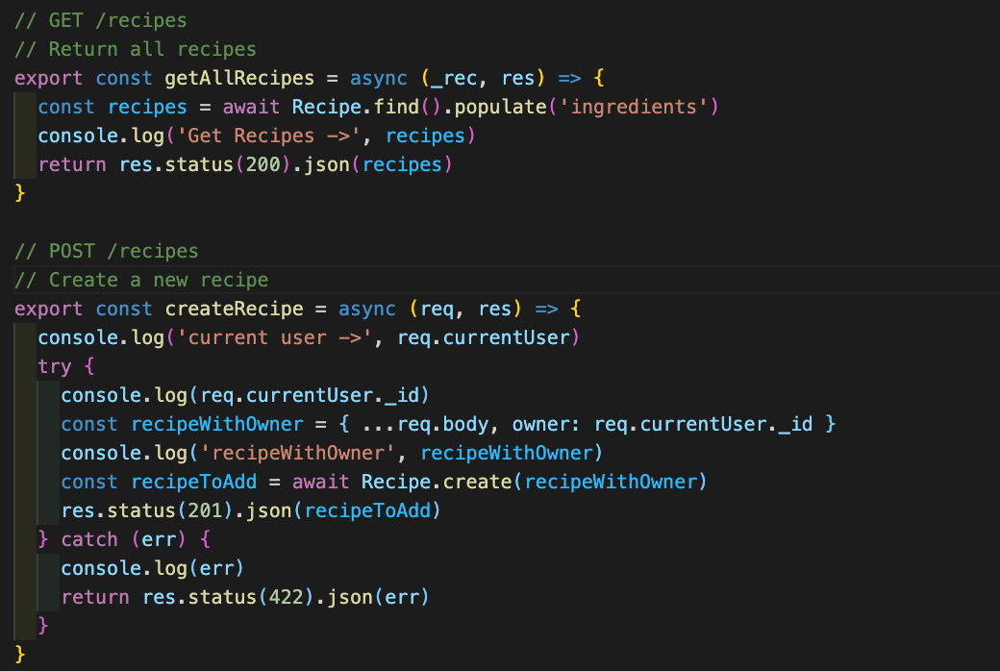

# Project 3 - How Green is Your Plate

## Overview
The third project of GA's Software Engineering Course, a group project to create a MERN stack app with @kate-lab and @mesowa.

The app has been deployed using Heroku and can be viewed <a href="https://greenplate.herokuapp.com/" target="_blank">here</a>

## Brief

- To build a full-stack application with both backend and frontend. 
- Use an Express API to serve data from a Mongo database on the backend.
- The frontend must consume the API and be built with React.

**Timeframe: 8 days**

## Technologies Used

- HTML5
- CSS3
- SASS
- JavaScript ES6
- MongoDB
- Express
- React
- Node.js
- JWT
- Bcrypt
- Git
- Insomnia

## Demonstrations of App Flow

### Register and Login
For users to register and login in order to add recipes to the site.

### Index page
Showing cards of all the recipes that have been added by users.

### Recipe page
Individual recipe page that displays the total environmental impact of each factor, as well as key ingredients, links to recipes and a description.

### Add a Recipe
Where users can add their own recipes using a form. They can select from a number of key ingredients that will in turn show the total environmental impact of a recipe.

## Process

Upon receiving the project brief, our team started out by brainstorming ideas for project ideas. We ultimately decided that we should create a project that we thought would remain current as well as relevant to our interests. Therefore we went with a vegan recipe website; our personal twist on this website was that we would include the environmental impacts of certain food ingredients.

As this was our first "major" group project we understood that communication and planning would play a crucial part in keeping our project on schedule. We agreed that keeping in contact through Slack made the most sense, whilst we would set up a Trello board to track our progress and update each other on what we may be working on at any point in time.

To get an understanding of what we wanted our website to look like we used Jamboard to create our wireframe.

### Dividing the workload:

We decided to complete the backend together as we understood that this part would need to be set up correctly before we could move on to the front end. The aim of coding together was to reduce the chances of errors. Once set up it would allow us to distribute the workload easier.

My personal contribution to the site was creating the main recipe index page and the individual recipe pages. The use of bootstrap was an effective tool as this allowed me to structure the page a little easier. With the backend set up the bulk of the information could now be "called" using an axios get request.

Showing the key ingredients from each recipe and the contributing environmental factors was an integral part of the site. 
As this information was to be seeded I had to keep in communication with Kate and Megan to essentially check when I could go ahead with creating the function to show the key ingredients.
By mapping through the ingredients called via the axios get request I was able to create a React Select function which would allow users to select specific ingredients, subsequently showing the recipes that included the selected ingredients.

Once this was done it was then possible to create a function to display the environmental impact as a figure.

When it came to styling, as I was tasked with creating the main pages for the Recipe Index, Recipe Cards and the Recipe Show pages I decided to use Bootstrap as a more efficient way to achieve a cleanly styled app.

### Results
I’m happy with what was achieved through this project. Taking on a unique idea meant that finding and accessing information through an API would potentially be a bit tricky. Although not part of our MVP, I would have liked for our site to have been less reliant on Bootstrap for styling as I believe it gives off a certain “blocky vibe” to the site. Whilst this was the correct decision given the time restraints, using CSS to add more personality to the site would have greatly improved the usability and differentiated it from other recipe websites. As the days progressed it felt gratifying to see the different components coming together into a complete project.

## Known errors/bugs
- When creating a recipe, adding an image would not always work. We came to find out that there was a timing issue, not enough time was given between uploading the picture and creating the recipe. To resolve this we would need to create a timer function that would not allow a user to click ahead when uploading an image.

## Wins/ Challenges
### Wins:
- Picking moments and sections to pair code meant that getting through trickier sections was smoother as we could point out any typos or errors.
- The API we chose included a lot of nested information. Being able to extract that information was integral to what we wanted our site to be.
- Developing an understanding of how the backend linked to the frontend with regards to the routes and axios requests.

### Challenges:
- Wrapping our heads around authentication and tying it to the front end for the registration and login component.
- This was the first time we were using Git, therefore we did have some trepidation when it came to merging our branches to the master branch. Through good communication we were able to avoid any major merge conflicts, although we did have a few small issues.

## Future Improvements
- Allow users to view all recipes from a specific user.
- Create a profile page that includes the user's favourite recipes.

## Key Learning

- The importance of good communication; thankfully, as a team, we stayed in constant communication and always made ourselves available whenever we needed to discuss issues we were facing whether code or Git related.
- Having a clear plan and setting targets helped the efficiency of the project and gave us a good idea of if we were on track to completing our minimal viable product (MVP).
- Project management, making sure we kept focus on our respective responsibilities with regards to an MVP.

